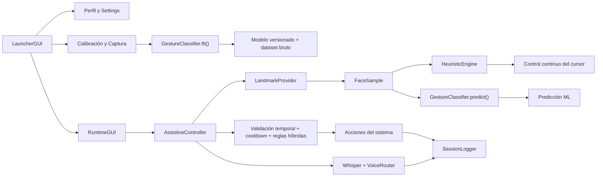

# Documentación Técnica de GIA v2

## 1. Propósito del documento

Este documento describe el estado técnico actual de **GIA v2**, un sistema asistivo de escritorio orientado a personas con movilidad reducida, con énfasis en usuarios que conservan movimiento de cabeza y ciertos gestos faciales. Su objetivo es servir como base técnica para:

- redacción de un artículo científico;
- análisis de arquitectura y lógica de operación;
- identificación de fortalezas y limitaciones del sistema actual;
- definición de futuras líneas de mejora.

El contenido refleja la **implementación real actual** del proyecto, no solo la visión futura.

## 2. Resumen del sistema

GIA v2 es un sistema **Windows-first** y **offline-first** que usa una cámara web para extraer landmarks faciales y convertirlos en mecanismos de interacción con el sistema operativo. Su enfoque actual es **híbrido**:

- **Heurístico** para control continuo del cursor, recentrado, estabilidad facial y funciones esenciales de clic.
- **Machine Learning** para clasificación de gestos discretos más complejos.
- **Reconocimiento de voz offline** como canal secundario de control.

El sistema se organiza en dos grandes superficies de interacción:

- **Launcher**: preparación obligatoria, calibración, diagnóstico, entrenamiento del modelo y configuración del perfil.
- **Runtime asistivo**: ejecución de la interacción facial en tiempo real.

## 3. Objetivo funcional

El sistema busca permitir que una persona pueda:

- mover el cursor mediante cabeza/rostro;
- ejecutar acciones básicas como clic izquierdo, clic derecho, pausa, recentrado o activación del cursor;
- usar comandos de voz offline;
- operar el entorno con una interfaz visual que apoye la calibración y el uso real.

## 4. Arquitectura del sistema

### 4.1 Vista general

### 4.2 Módulos principales

#### Punto de entrada

- [main.py](D:\IEEE-Movilidad-reducidad\ProyectoGIA-main\GIA\main.py)

Responsabilidad:

- inicializar la aplicación;
- asegurar directorios base;
- mostrar primero el launcher;
- destruir el contenido anterior del root y lanzar el runtime cuando el perfil está listo.

#### Interfaz de preparación

- [app/launcher_gui.py](D:\IEEE-Movilidad-reducidad\ProyectoGIA-main\GIA\app\launcher_gui.py)

Responsabilidad:

- selección y creación de perfiles;
- diagnóstico inicial;
- edición de ajustes;
- guía de gestos y comandos;
- captura guiada de muestras faciales;
- entrenamiento del clasificador;
- validación mínima antes de iniciar el runtime.

#### Interfaz de operación

- [app/runtime_gui.py](D:\IEEE-Movilidad-reducidad\ProyectoGIA-main\GIA\app\runtime_gui.py)

Responsabilidad:

- visualizar el feed principal de cámara;
- mostrar estado, gesto, confianza, voz y eventos;
- ofrecer controles manuales de pausa, recentrado, cursor y cierre;
- gestionar una **ventana compacta superior** con log y mini vista de cámara.

#### Controlador central

- [app/assistive_controls.py](D:\IEEE-Movilidad-reducidad\ProyectoGIA-main\GIA\app\assistive_controls.py)

Responsabilidad:

- orquestar la adquisición de cámara;
- procesar landmarks;
- ejecutar heurística y ML;
- validar gestos;
- mover el cursor;
- ejecutar acciones locales;
- gestionar escucha de voz;
- renderizar overlays sobre la cámara;
- enviar estado a la UI;
- registrar eventos de sesión.

#### Extracción facial

- [app/landmark_provider.py](D:\IEEE-Movilidad-reducidad\ProyectoGIA-main\GIA\app\landmark_provider.py)

Responsabilidad:

- usar **MediaPipe Tasks FaceLandmarker**;
- extraer landmarks faciales seleccionados;
- derivar métricas geométricas;
- producir instancias de `FaceSample`.

#### Motor heurístico

- [app/heuristic_engine.py](D:\IEEE-Movilidad-reducidad\ProyectoGIA-main\GIA\app\heuristic_engine.py)

Responsabilidad:

- transformar desplazamiento de nariz respecto a una referencia neutral en velocidad de cursor;
- aplicar:
  - inversión de ejes;
  - zona muerta;
  - mapeo no lineal;
  - suavizado adaptativo;
  - límite máximo de velocidad;
  - evaluación de estabilidad facial.

#### Clasificador de gestos

- [app/gesture_ml.py](D:\IEEE-Movilidad-reducidad\ProyectoGIA-main\GIA\app\gesture_ml.py)

Responsabilidad:

- convertir ventanas temporales de `FaceSample` en vectores de features;
- entrenar un `RandomForestClassifier`;
- versionar modelos y datasets por perfil;
- devolver predicciones con probabilidad.

#### Configuración y persistencia

- [app/config_store.py](D:\IEEE-Movilidad-reducidad\ProyectoGIA-main\GIA\app\config_store.py)

Responsabilidad:

- definir rutas base;
- cargar/guardar settings y perfiles;
- administrar rutas de calibración, modelos y logs;
- mantener defaults del sistema.

#### Catálogo de gestos y ayuda

- [app/gesture_catalog.py](D:\IEEE-Movilidad-reducidad\ProyectoGIA-main\GIA\app\gesture_catalog.py)

Responsabilidad:

- declarar catálogo descriptivo de gestos;
- exponer la ayuda mostrada en launcher y runtime;
- centralizar descripciones para UI.

#### Enrutado de voz

- [app/voice_router.py](D:\IEEE-Movilidad-reducidad\ProyectoGIA-main\GIA\app\voice_router.py)

Responsabilidad:

- normalizar texto reconocido;
- comparar aliases de comandos;
- resolver el identificador del comando y su score.

#### Logging estructurado

- [app/session_logger.py](D:\IEEE-Movilidad-reducidad\ProyectoGIA-main\GIA\app\session_logger.py)

Responsabilidad:

- registrar eventos en `jsonl`;
- exportar un resumen secundario en `xlsx`.

#### Modelos de datos

- [app/models.py](D:\IEEE-Movilidad-reducidad\ProyectoGIA-main\GIA\app\models.py)

Responsabilidad:

- definir estructuras de datos del sistema:
  - `AppState`
  - `FaceSample`
  - `ContinuousControlState`
  - `GesturePrediction`
  - `SessionEvent`

## 5. Lógica operativa del sistema

### 5.1 Flujo general de operación

1. El usuario ejecuta `main.py`.
2. El sistema abre el **launcher**.
3. El usuario selecciona o crea un perfil.
4. El usuario puede:
   - revisar guía;
   - ejecutar diagnóstico;
   - ajustar parámetros;
   - capturar neutral y gestos;
   - entrenar un modelo.
5. Si el perfil tiene calibración y modelo activo, se habilita el inicio del runtime.
6. En runtime:
   - se abre la cámara;
   - se detecta un rostro;
   - se extraen landmarks y métricas;
   - el motor heurístico calcula control del cursor;
   - el clasificador ML evalúa ventanas temporales;
   - se aplican validaciones de confianza, duración y cooldown;
   - se ejecutan acciones;
   - se actualiza la interfaz y el log.

### 5.2 Estados del sistema

El sistema usa una máquina de estados representada en `AppState`:

- `launcher`
- `calibrating`
- `testing`
- `ready`
- `paused`
- `listening`
- `error`
- `stopped`

En la práctica actual, los estados más usados en runtime son:

- `ready`
- `paused`
- `listening`
- `error`
- `stopped`

## 6. Percepción facial

### 6.1 Extracción de landmarks

El módulo `LandmarkProvider` usa `MediaPipe Tasks FaceLandmarker` con:

- `running_mode = VIDEO`
- `num_faces = 1`
- `min_face_detection_confidence = 0.5`
- `min_face_presence_confidence = 0.5`
- `min_tracking_confidence = 0.5`

Se selecciona un subconjunto de landmarks faciales relevantes para:

- ojos;
- boca;
- cejas;
- nariz;
- ancho facial;
- mentón.

### 6.2 Representación por frame

Cada frame se convierte en un `FaceSample`, que contiene:

- `timestamp_ms`
- `normalized_landmarks`
- `metrics`
- `points_px`
- `nose_px`
- `face_scale_px`
- `face_center_px`

### 6.3 Métricas derivadas

Las métricas actuales son:

- `left_eye_ratio`
- `right_eye_ratio`
- `mouth_open_ratio`
- `smile_ratio`
- `brow_raise_ratio`

Estas métricas se calculan con relaciones geométricas normalizadas, por ejemplo:

- apertura vertical / distancia horizontal del ojo;
- apertura vertical / distancia horizontal de la boca;
- ancho de sonrisa / altura relativa de la cara.

## 7. Lógica heurística

### 7.1 Qué se entiende por heurística en este sistema

Un enfoque heurístico implica que el sistema decide usando **reglas explícitas** diseñadas por el programador, no exclusivamente a partir de un modelo entrenado.

Ejemplos:

- si la nariz se desplaza respecto a la referencia neutral, el cursor se mueve;
- si la desviación está dentro de la zona muerta, el cursor no se mueve;
- si un ojo está claramente más cerrado que el otro, se puede interpretar un guiño heurístico.

### 7.2 Control continuo del cursor

El movimiento del cursor es actualmente **heurístico** y está basado en:

- posición de nariz respecto a una referencia neutral;
- normalización por escala facial;
- inversión opcional de ejes;
- mapeo a velocidad por tramos;
- suavizado adaptativo;
- límite de velocidad.

### 7.3 Mapeo del desplazamiento a velocidad

El sistema no mueve el cursor por posición absoluta, sino por **velocidad**.

Esto significa:

- cerca del centro neutral, el movimiento es nulo;
- con desviación pequeña, el movimiento es fino;
- con desviación media, el movimiento aumenta;
- con desviación grande, se alcanza la velocidad máxima.

Ventajas:

- más estabilidad;
- mayor control fino;
- mejor ergonomía que un mapeo lineal directo.

### 7.4 Estabilidad facial

La estabilidad se estima observando el cambio de nariz entre frames normalizado por escala facial. Si el rostro está demasiado errático y no hay intención aparente de movimiento, el estado puede marcarse como inestable.

### 7.5 Clutch del cursor

El cursor tiene dos modos:

- `activo`
- `congelado`

Esto permite reposicionar la cabeza sin desplazar el puntero. El clutch puede activarse con:

- gesto `mouth_open_hold`;
- botón manual en UI;
- comandos de voz.

### 7.6 Fallback heurístico para clic izquierdo y derecho

Dado que el clasificador ML aún está en fase de maduración, el sistema ya incorpora un **fallback heurístico** para las funciones esenciales:

- `left_blink_intent`
- `right_blink_intent`

El fallback se activa cuando:

- el ML no predice nada útil, o
- predice guiño con confianza insuficiente.

La decisión heurística usa:

- ratio del ojo cerrado;
- ratio del ojo opuesto abierto;
- asimetría mínima entre ambos.

Con esto se busca que el clic básico siga funcionando incluso si el modelo aún no está suficientemente robusto.

## 8. Lógica de Machine Learning

### 8.1 Objetivo del clasificador

El ML se usa para reconocer gestos faciales discretos más complejos o menos deterministas.

Clases actuales:

- `neutral`
- `left_blink_intent`
- `right_blink_intent`
- `both_eyes_closed_intent`
- `mouth_open_hold`
- `smile`
- `brows_up`
- `confirm`

### 8.2 Ventana temporal

La clasificación no se hace frame a frame, sino sobre una ventana temporal de:

- `12` frames

Esto reduce ruido y permite capturar dinámica temporal del gesto.

### 8.3 Extracción de features

Para cada ventana, el sistema concatena:

- landmarks faciales aplanados;
- métricas por frame;
- medias de landmarks;
- desviaciones estándar;
- medias de métricas;
- desviaciones estándar de métricas;
- deltas entre primer y último frame.

Este vector de features resume tanto:

- estructura espacial;
- como evolución temporal breve del gesto.

### 8.4 Modelo usado

Modelo actual:

- `RandomForestClassifier`
- `n_estimators = 300`
- `random_state = 42`
- `class_weight = "balanced_subsample"`

Razones prácticas de esta elección:

- robustez razonable con datasets pequeños;
- bajo costo de entrenamiento;
- facilidad de serialización;
- buena base para prototipado offline.

### 8.5 Inferencia

Durante runtime:

1. se acumulan `FaceSample` en una cola;
2. si hay suficientes frames, se extrae el vector;
3. el modelo calcula `predict_proba`;
4. se toma la clase con mayor probabilidad;
5. se construye un `GesturePrediction`.

## 9. Validación híbrida

El sistema actual ya no es puramente ML ni puramente heurístico. Usa una **validación híbrida** para aumentar robustez.

### Caso implementado actualmente: ambos ojos cerrados

El gesto `both_eyes_closed_intent` puede aceptarse aunque la confianza del modelo no sea alta, siempre que:

- ambos ojos tengan ratios suficientemente bajos;
- la asimetría entre ambos no sea excesiva;
- la confianza supere un piso mínimo híbrido.

Esto se diseñó porque el cierre bilateral de ojos puede ser difícil de separar del resto del espacio de clases solo con probabilidad del clasificador.

## 10. Reglas de aceptación de gestos

Un gesto no se ejecuta automáticamente al ser predicho. Antes debe pasar por varias condiciones:

1. `face_present`
2. `face_stable`
3. confianza suficiente o validación híbrida
4. duración mínima del gesto
5. cooldown superado
6. compatibilidad con el estado actual del sistema

Esto evita que una predicción momentánea o inestable dispare una acción crítica.

## 11. Voz y control secundario

### 11.1 Activación de voz

La escucha de voz no está siempre activa. Se activa por gesto:

- `both_eyes_closed_intent`

### 11.2 Reconocimiento

El sistema graba aproximadamente 3 segundos de audio y usa:

- `faster-whisper`

para transcribir localmente.

### 11.3 Enrutado de comandos

El texto reconocido se normaliza y se compara contra aliases definidos en `VOICE_ALIASES` mediante `SequenceMatcher`.

Esto evita depender de un pipeline NLP pesado para comandos cerrados.

### 11.4 Comandos relevantes actuales

Entre los comandos actuales:

- `pausar sistema`
- `reanudar sistema`
- `activar cursor`
- `congelar cursor`
- `centrar cursor`
- `abrir guia`
- `estamos listos`
- `volvamos`
- `cerrar sistema`
- volumen y accesos web integrados

## 12. Interfaz gráfica

### 12.1 Launcher

El launcher es una parte fundamental del sistema, no un accesorio. Su función es:

- evitar iniciar un perfil sin preparación;
- centralizar calibración;
- reducir dependencia de archivos manuales;
- ofrecer diagnóstico antes de entrar al runtime.

### 12.2 Runtime completo

La interfaz completa muestra:

- video principal con overlay;
- estado del sistema;
- gesto predicho;
- confianza;
- estado del rostro;
- estado del cursor;
- estado de voz;
- texto reconocido;
- comando interpretado;
- eventos recientes;
- resumen de gestos y voz.

### 12.3 Runtime compacto

El runtime compacto:

- oculta la ventana principal;
- crea una ventana superior reducida;
- deja visible el escritorio;
- conserva:
  - mini cámara de referencia;
  - estado resumido;
  - texto/comando de voz;
  - log de comandos ejecutados.

La mini cámara compacta usa una versión limpia del overlay:

- centro de cámara;
- referencia de cursor;
- sin textos diagnósticos ni métricas.

## 13. Persistencia del sistema

### 13.1 Settings globales

- [config/settings.json](D:\IEEE-Movilidad-reducidad\ProyectoGIA-main\GIA\config\settings.json)

Guarda parámetros generales como:

- FPS;
- índice de cámara;
- ventana temporal;
- parámetros base del sistema.

### 13.2 Perfiles

- [config/user_profiles/](D:\IEEE-Movilidad-reducidad\ProyectoGIA-main\GIA\config\user_profiles)

Cada perfil contiene:

- sensibilidad;
- zona muerta;
- suavizado;
- velocidad máxima;
- inversión de ejes;
- vista espejo;
- activación inicial del cursor;
- umbrales de confianza;
- duraciones;
- cooldowns;
- referencias neutrales;
- estado de calibración.

### 13.3 Modelos y datasets

Se guardan en:

- [data/calibration/](D:\IEEE-Movilidad-reducidad\ProyectoGIA-main\GIA\data\calibration)

Con versionado por perfil:

- `perfil_gesture_model_vN.pkl`
- `perfil_landmark_dataset_vN.json`
- `model_registry.json`
- `perfil_dataset_summary.json`

### 13.4 Logs

Se guardan en:

- [data/logs/](D:\IEEE-Movilidad-reducidad\ProyectoGIA-main\GIA\data\logs)

Formatos:

- `.jsonl`
- `.xlsx`

## 14. Fortalezas del sistema actual

### 14.1 Arquitectura modular clara

El proyecto ya no es un script monolítico. Tiene separación explícita entre:

- UI;
- percepción facial;
- control heurístico;
- ML;
- configuración;
- logging;
- voz.

### 14.2 Diseño híbrido pragmático

La combinación de heurística + ML es una fortaleza real:

- heurística para control continuo y funciones esenciales;
- ML para gestos discretos más complejos.

Esto reduce dependencia de un único enfoque.

### 14.3 Persistencia y reproducibilidad

El sistema ya cuenta con:

- perfiles;
- datasets versionados;
- modelos versionados;
- logs estructurados.

Esto es valioso para investigación, trazabilidad y mejora iterativa.

### 14.4 Offline-first

El sistema puede operar sin depender de Internet para sus funciones principales:

- landmarks;
- inferencia;
- voz;
- comandos.

### 14.5 Launcher obligatorio

Desde perspectiva científica y de usabilidad, el launcher es una fortaleza porque formaliza:

- calibración;
- entrenamiento;
- diagnóstico;
- control de calidad previo.

## 15. Limitaciones actuales

### 15.1 Entrenamiento ML aún inmaduro

Aunque ya existe un pipeline razonable, el modelo aún depende mucho de:

- calidad del dataset por perfil;
- consistencia del usuario;
- número de muestras;
- separación real entre clases.

No se puede considerar todavía un reconocedor plenamente robusto.

### 15.2 Gestos ambiguos

Algunos gestos faciales, especialmente los asociados a ojos, tienen alta similitud entre clases:

- guiños;
- cierre bilateral;
- neutral con parpadeo parcial.

Esto limita la separabilidad del clasificador.

### 15.3 No hay todavía modelo base global

El sistema actual trabaja principalmente con modelos por perfil. Eso es útil en prototipado, pero científicamente deja abierta la pregunta de generalización interusuario.

### 15.4 Validación experimental aún insuficiente

No existe todavía una evaluación extensa con:

- múltiples usuarios;
- sesiones prolongadas;
- condiciones de iluminación variadas;
- análisis formal de falsos positivos/falsos negativos.

### 15.5 Dependencia de Windows y GUI local

El sistema está diseñado para escritorio Windows y no es todavía portable ni orientado a despliegue multiplataforma.

### 15.6 Cursor del sistema sin realce accesible integrado

El sistema controla el cursor, pero la visibilidad del puntero aún depende del entorno del usuario. No existe todavía un módulo propio de realce visual del puntero.

## 16. Futuras mejoras recomendadas

### 16.1 Mejoras de ML

- introducir un **modelo base global**;
- usar calibración por perfil como ajuste, no como entrenamiento desde cero;
- incorporar evaluación cuantitativa por clase;
- añadir matrices de confusión;
- medir precisión, recall y F1 por gesto.

### 16.2 Mejora del dataset

- capturas múltiples por gesto;
- validación de calidad de captura;
- mejor balance entre clases;
- persistencia más rica de metadatos experimentales;
- datasets con múltiples usuarios.

### 16.3 Mejora del enfoque híbrido

- ampliar validaciones híbridas a más gestos ambiguos;
- usar reglas complementarias para sonrisa, boca en O y guiños;
- parametrizar mejor estas reglas por perfil.

### 16.4 Evaluación de usabilidad

- tiempo de selección de objetivos;
- tasa de clic exitoso;
- fatiga del usuario;
- tiempo de calibración;
- estabilidad del control en sesiones largas.

### 16.5 Mejora de accesibilidad visual

- realce del cursor;
- mejor contraste configurable;
- ajuste fino de overlays;
- ayudas visuales de zona neutral y rango cómodo.

### 16.6 Ingeniería de producto

- empaquetado con PyInstaller;
- recuperación más robusta ante fallos de cámara o audio;
- mayor cobertura de pruebas;
- herramientas internas para inspección de datasets y versiones de modelos.

## 17. Valor científico del sistema

Desde una perspectiva de artículo científico, GIA v2 ya ofrece varios ejes de interés:

- integración híbrida heurística + ML en accesibilidad facial;
- diseño de launcher obligatorio como componente de preparación asistiva;
- uso de landmarks faciales normalizados en vez de imagen cruda;
- versionado de datasets y modelos por perfil;
- control facial orientado a interacción real con el escritorio.

El valor del trabajo puede centrarse en:

- la arquitectura híbrida;
- la personalización por perfil;
- la transición de un prototipo frágil a un sistema modular y medible;
- el análisis comparativo entre reglas heurísticas y clasificación basada en landmarks.

## 18. Conclusión técnica

GIA v2 se encuentra en una fase intermedia: ya superó el estado de prototipo monolítico y ahora posee una arquitectura modular, una estrategia híbrida sensata y mecanismos de persistencia útiles para investigación. Sin embargo, todavía no debe considerarse un sistema asistivo terminado ni clínicamente robusto.

Su mayor fortaleza actual es la combinación de:

- modularidad;
- control heurístico continuo;
- clasificación ML discreta;
- perfiles persistentes;
- calibración previa obligatoria.

Su principal desafío actual es llevar esa base a una validación experimental más fuerte, mejorar la robustez del reconocimiento gestual y consolidar una experiencia de usuario suficientemente estable para uso prolongado.

